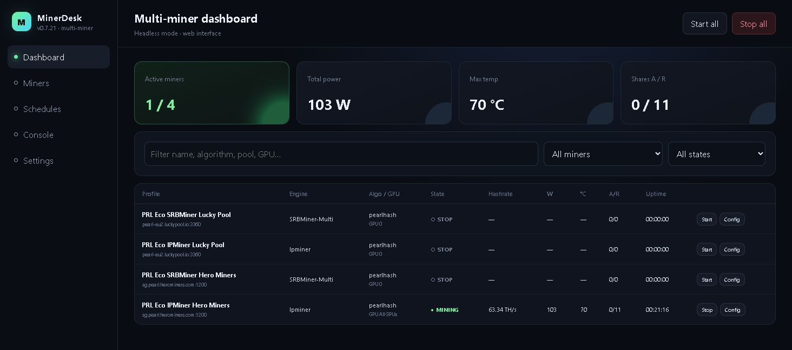
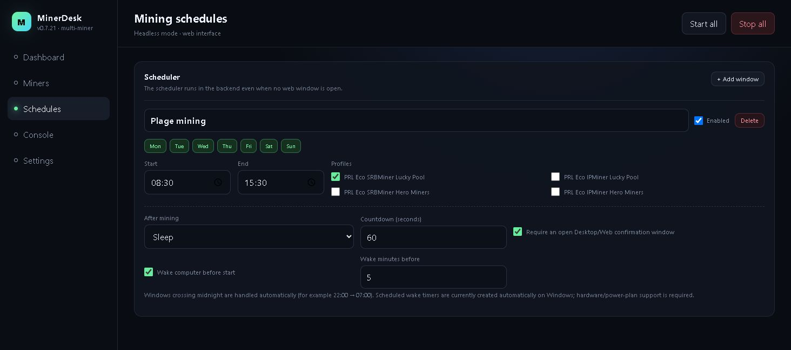

<div align="center">
  
  <h1>MinerDesk</h1>
  <p><strong>Your miners. Your schedule. One dashboard.</strong></p>
  <p>Manage GPU mining profiles, monitor sessions and schedule mining hours on your Windows or Linux PC.</p>
  <p>Free and open source · Optional developer tip: 0% by default · Mining engines downloaded separately</p>
  <p>
    <a href="https://github.com/jontechlabs/MinerDesk/releases/latest"></a>
    <a href="LICENSE"></a>
    <a href="https://github.com/jontechlabs/MinerDesk/actions/workflows/ci.yml"></a>
  </p>
  <p><a href="https://github.com/jontechlabs/MinerDesk/releases/latest"><strong>Download</strong></a> · <a href="#get-started">Get started</a> · <a href="docs/README.fr.md">Français</a> · <a href="CHANGELOG.md">Changelog</a></p>
  <p><a href="https://github.com/jontechlabs/MinerDesk/releases/download/v0.7.22/MinerDesk_0.7.22_x64-setup.exe"><strong>Windows installer — 0.7.22</strong></a> · <a href="https://github.com/jontechlabs/MinerDesk/releases/download/v0.7.22/MinerDesk_0.7.22_amd64.deb"><strong>Linux .deb — 0.7.22</strong></a> · <a href="https://github.com/jontechlabs/MinerDesk/releases/latest">Other downloads & checksums</a></p>
  <p><a href="https://youtu.be/NFa6s8z84Xk">Watch the 2-minute English demo</a> · <a href="https://youtu.be/KBOYEVBF9Ic">Voir la démo en français</a> · <a href="docs/TRY-MINERDESK.md">Try one profile</a></p>
</div>



## Why MinerDesk?

Keep your pool settings, GPU choices and schedules in one place instead of maintaining a collection of launch scripts. See what is running, stop it when you need your GPU, and let recurring schedules handle the next session.

Start with MinerDesk if you already mine on a Windows or Linux machine and want saved profiles, scheduled hours and a shared dashboard for your engines. For Pearl / PRL, check your engine's current GPU, algorithm and pool requirements; MinerDesk manages that engine rather than replacing it.

| When you want to… | MinerDesk helps you… |
| --- | --- |
| Switch between mining engines or pools | Save separate profiles and launch them from the same interface. |
| Mine during specific hours | Set weekly windows, including overnight sessions, with optional sleep or hibernate afterward. |
| Keep an eye on a machine | Inspect hashrate, power, temperature, shares, uptime and logs from the desktop or a trusted browser connection. |
| Use different GPU settings per profile | Select devices and translate supported clock, power and fan settings to each engine's command line. |
| Take manual control | Stop a scheduled session without it immediately restarting; explicitly Start to resume. |

**MinerDesk is an orchestrator, not a mining engine, wallet or profitability service.** Mining is performed by separately downloaded third-party programs. Results depend on your hardware, driver, engine, pool and settings. No earnings or efficiency gains are promised.

## Download

Open [the latest release](https://github.com/jontechlabs/MinerDesk/releases/latest) and choose the asset for your system.

| Platform | Asset | Use |
| --- | --- | --- |
| Windows 10/11 x64 | `MinerDesk_0.7.22_x64-setup.exe` | Recommended desktop installation, including both backends. |
| Windows x64 | `MinerDesk_0.7.22_windows-x64.zip` | The desktop, windowless backend and standalone CLI together. The installer is preferable for privileged-backend setup. |
| Debian-compatible Linux x64 | `MinerDesk_0.7.22_amd64.deb` | Desktop and CLI package; install with `sudo apt install ./MinerDesk_0.7.22_amd64.deb`. |
| Linux x64 | `MinerDesk_0.7.22_amd64.AppImage` | Application image; make executable before launching. |
| Linux x64 | `MinerDesk_0.7.22_linux-x64.tar.gz` | Desktop and standalone headless executables; system libraries are still required. |

Verify downloads against `SHA256SUMS.txt` in the release. Builds are **unsigned**; a checksum verifies the downloaded bytes, not the identity of a publisher. Linux compatibility and exact validation are recorded in the release notes. macOS and ARM packages are not provided.

## Get started

1. Install and open MinerDesk. On Windows, the installer configures the privileged backend while the desktop runs without administrator rights.
2. Open **Miners**, choose an engine and download it, or select an existing executable. Custom executables are supported.
3. Enter the algorithm, pool and your **public receiving address or pool username**. Never enter a seed phrase or private key.
4. Select GPUs and optionally set supported tuning values. Save the profile.
5. Press **Start**, check **Console** for connection details, and monitor the **Dashboard**.
6. Add a weekly window under **Schedules** if you want recurring sessions.

The optional developer tip is **0% by default**, visible and selectable per profile. It can be disabled at any time. Third-party mining engines may have their own fees and licenses.

**Trying it for the first time?** Follow the [one-profile walkthrough](docs/TRY-MINERDESK.md), then [share your setup and what worked](https://github.com/jontechlabs/MinerDesk/issues/new?template=setup_report.yml). Reports of installation problems are just as useful as successful sessions. If MinerDesk helps you, a GitHub star helps others discover and revisit the project.

## Features

- **Multiple profiles:** independent pools, wallets, workers, GPUs, tuning, API ports and advanced arguments.
- **Live overview:** active profiles, parsed hashrate, power, temperature, shares and uptime, with engine/state filters.
- **A console per profile:** stdout/stderr, generated command lines and persistent command errors.
- **Weekly scheduling:** multiple weekdays/profiles, overnight windows, manual holds and optional power actions.
- **Desktop and browser access:** the same React interface, served by a Rust backend with an embedded frontend.
- **Windows lifecycle protection:** windowless privileged backend, Job Objects for managed miners, desktop heartbeat and PID checks.
- **13 languages:** English, French, Spanish, Portuguese, German, Simplified Chinese, Hindi, Bengali, Urdu, Indonesian, Arabic, Russian and Japanese. Arabic and Urdu support RTL layout.

Metrics are parsed from miner output. Availability and interpretation depend on the engine; the dashboard is not a calibrated power meter or accounting ledger.

## Supported engines and GPU tuning

| Engine | Download source | Device / tuning adapter |
| --- | --- | --- |
| SRBMiner-Multi | [doktor83/SRBMiner-Multi](https://github.com/doktor83/SRBMiner-Multi) | GPU selection, core clock, power and fan |
| lolMiner | [Lolliedieb/lolMiner-releases](https://github.com/Lolliedieb/lolMiner-releases) | GPU selection, core clock, power and fan |
| BzMiner | [bzminer/bzminer](https://github.com/bzminer/bzminer) | Device selectors, core clock, power and fan |
| Rigel | [rigelminer/rigel](https://github.com/rigelminer/rigel) | GPU selection, core clock, power and fan |
| lpminer / pearl-miner | [BaikalMine-Pools/pearl-miner](https://github.com/BaikalMine-Pools/pearl-miner) | Shared absolute core-clock lock |
| NPMiner | [nushypool/npminer](https://github.com/nushypool/npminer) | GPU selection, CUDA core clock and power |
| Custom executable | Supplied by you | Your executable and extra arguments |

Support here means an adapter exists; it does not guarantee every engine/version/GPU/OS combination. Device detection uses engine output and system fallbacks such as `nvidia-smi`. Unsupported controls are not invented: lpminer rejects conflicting per-GPU clocks, and NPMiner does not have a fan-control adapter. Legacy profile-wide tuning remains a fallback. Stop → edit → Start builds fresh arguments from the saved profile.

## Scheduling that respects manual control



The scheduler runs in Rust. Closing a browser tab does not stop scheduling while its owning backend is running.

- **Stop** holds the profile for its current dated schedule occurrence, including overnight and overlapping windows.
- **Stop all** also holds eligible stopped/failed profiles so they cannot immediately retry.
- A successful manual **Start / Restart** clears the relevant hold and starts a user-owned session. The scheduler does not stop that manual session when a window ends.
- The next occurrence can run normally. Holds are persisted beside the configuration.
- Sleep/hibernate is blocked by another active window or a manual mining session. When UI confirmation is required, an open confirmation UI is required; cancellation aborts the action.
- Windows wake timers depend on hardware and power-plan support. Linux sleep/hibernate uses `systemctl` where supported; automatic wake-task creation is Windows-specific.

Screenshots were captured from the author's running **0.7.21 web interface**; 0.7.22 retains that interface. Values show one real session, not a benchmark.

## Desktop, backend and headless architecture

Built with **Tauri 2 · React 18 · TypeScript · Vite · Rust · Tokio · Axum**.

| Windows executable | Responsibility |
| --- | --- |
| `MinerDesk.exe` | Normal-user desktop window, WebView2, tray and backend handshake. |
| `minerdesk-backend.exe` | Actual windowless, desktop-owned privileged backend. Owns miners, scheduler, API and privileged operations. |
| `minerdesk-headless.exe` | Independent console CLI with visible output, Ctrl+C and redirection support. |

The Windows scheduled task **MinerDesk Privileged Backend** starts the backend with `--desktop-owned`. Restart policy is three attempts at one-minute intervals. Managed mining trees are created suspended, assigned to Windows Job Objects with kill-on-close, then resumed. Heartbeat loss is checked against the desktop PID before treating the desktop as dead.

A real desktop exit stops its backend and miners. Hiding to the tray does not exit. An independently started CLI is not owned by the desktop. Linux uses the desktop-hosted backend or the standalone CLI, without Windows elevation tasks or Job Objects.

## Web and headless mode

Local access defaults to `http://127.0.0.1:17888/`.

```powershell
# Windows: independent console backend
.\minerdesk-headless.exe --listen 127.0.0.1 --port 17888
```

```bash
# Linux: independent console backend
./minerdesk-headless --listen 127.0.0.1 --port 17888
```

Optional LAN access uses `--listen 0.0.0.0 --port 17888 --token YOUR_STRONG_TOKEN` or the LAN setting in the UI. Remote API clients send `X-MinerDesk-Token` or `Authorization: Bearer YOUR_STRONG_TOKEN`; a browser can use `http://HOST:17888/?token=YOUR_STRONG_TOKEN`. Keep token-bearing URLs out of screenshots, logs and issue reports.

Treat this API as control of the machine: it can configure executables and start/stop them. Local processes are trusted. Do not expose the HTTP service directly to the Internet, and do not rely on it for public TLS termination. Prefer a trusted VPN such as Tailscale or WireGuard. See [security](SECURITY.md) and [API reference](docs/API.md).

## Build from source

### Windows

Install Node.js LTS, Rust stable MSVC, Visual Studio Build Tools 2022 with **Desktop development with C++** and a Windows SDK, plus WebView2 Runtime. Then, from the repository root:

```powershell
npm ci --include=dev
Set-ExecutionPolicy -Scope Process Bypass
.\scripts\build-windows.ps1
```

The canonical script runs regression checks, builds the frontend and both backends, verifies their PE subsystem types, builds the desktop/NSIS installer, and publishes only after validation. Output: `publish/windows-x64/`. See [SETUP-WINDOWS.md](SETUP-WINDOWS.md).

### Linux

Install the [Tauri Linux prerequisites](https://v2.tauri.app/start/prerequisites/), Node.js LTS and Rust stable, then:

```bash
npm ci --include=dev
bash scripts/build-linux.sh
# Only Debian packaging:
MINERDESK_BUNDLES=deb bash scripts/build-linux.sh
```

Output: `publish/linux-x64/`. The script builds the frontend, runs Rust tests, builds the standalone CLI and packages the desktop. The platform config also supports `npx tauri build --bundles deb,appimage` after prerequisites/dependencies are installed. Use an older supported build baseline to avoid unnecessarily raising glibc requirements. See [BUILD-LINUX.md](BUILD-LINUX.md) for the tested baseline and dependencies.

Platform-specific Tauri configs keep NSIS, installer hooks and `.exe` resources on Windows only. The shared configuration is cross-platform.

## Configuration and data

| Data | Windows | Linux (typical) |
| --- | --- | --- |
| Configuration | `%APPDATA%\MinerDesk\config.json` | `~/.config/MinerDesk/config.json` |
| Scheduler holds | `scheduler-manual-stops.json` beside config | Same |
| Backend log | `backend.log` beside config | Same |
| Downloaded engines | `C:\ProgramData\MinerDesk\miners\` | `~/.local/share/MinerDesk/miners/` |
| Installer logs | `C:\ProgramData\MinerDesk\logs\` | Not applicable |

Linux locations follow `dirs-next` and your environment. Upgrades preserve configuration and managed miners. Back up configuration privately; it can contain wallet identifiers, pool passwords and the access token. These files, build outputs, dependencies and mining executables are excluded from Git.

## Troubleshooting

| Symptom | Start here |
| --- | --- |
| Profile does not start | Check the per-profile error and Console, executable path, pool/algorithm and GPU overlap. |
| Start all only partly succeeds | Read each profile's error; a successful HTTP response does not mean every miner started. |
| Scheduler does not restart a stopped profile | Check the “Scheduler paused manually” state; manual Stop is intentionally respected. |
| Windows backend unavailable | Use backend diagnostics in Settings; check `backend.log` and the privileged task. |
| Installer fails | Read `setup-maintenance.log`; do not use an older installer as a substitute for a failed build. |
| GPU tuning has no effect | Confirm the engine supports that flag, selected device IDs, driver permissions and saved values. |
| No LAN connection | Check bind mode, token, port and Private-network firewall settings. |
| Antivirus flags a mining engine | Verify its upstream origin. Miner/PUA detection is common; an exclusion is not proof a binary is safe. |

Defender integration is optional and scoped to the managed-miner directory. Administrative policy or Tamper Protection can reject changes; errors are surfaced. MinerDesk never needs wallet secrets.

## Development and contributing

```bash
npm test
npm run build
cargo test --locked --manifest-path src-tauri/Cargo.toml --lib
npm run tauri:dev
```

`src/` contains the UI; `src-tauri/src/lib.rs` owns orchestration/API/runtime behavior; `schedule_control.rs` and `config_sync.rs` contain tested scheduler and background-worker policy. `src-tauri/windows/` holds installer maintenance. CI compiles and tests on Windows and Linux without starting miners or changing host security settings.

Read [CONTRIBUTING.md](CONTRIBUTING.md), [validation notes](docs/VALIDATION.md) and [release history](CHANGELOG.md). Report bugs through [Issues](https://github.com/jontechlabs/MinerDesk/issues) with sanitized diagnostics. Security reports belong in [private vulnerability reporting](https://github.com/jontechlabs/MinerDesk/security/advisories/new).

## License

[MIT](LICENSE). Downloaded mining engines remain subject to their respective licenses and fees.
